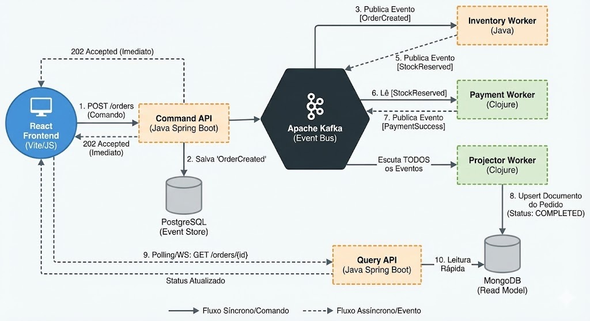

Markdown# 🛒 Event-Driven Mall (Janus Commerce)


> **Simulação de um ecossistema de varejo distribuído, focado em alta performance e desacoplamento através de Event-Driven Architecture (EDA), CQRS e Event Sourcing.**

---

## 📐 Arquitetura do Sistema

O projeto adota uma abordagem **poliglota e híbrida**, aproveitando a robustez e tipagem do **Java (Spring Boot)** para APIs de borda e regras de negócio críticas, combinada com a expressividade e imutabilidade funcional do **Clojure** para processamento de streams e projeção de dados.

### Fluxo de Dados (CQRS)
A arquitetura é estritamente dividida entre **Comando (Escrita)** e **Consulta (Leitura)**, utilizando o Apache Kafka como espinha dorsal para comunicação assíncrona.



1.  **Command Side (Write):** A `Command API` recebe a intenção do usuário, valida e persiste o evento inicial no PostgreSQL (Source of Truth).
2.  **Event Bus:** O evento é publicado no Kafka, onde múltiplos consumidores reagem independentemente.
3.  **Workers:**
    * *Inventory Worker (Java):* Garante integridade de estoque.
    * *Payment Worker (Clojure):* Processa transações financeiras.
    * *Projector Worker (Clojure):* Escuta todos os eventos e materializa uma "view" otimizada no MongoDB.
4.  **Query Side (Read):** A `Query API` lê os dados prontos do MongoDB, oferecendo respostas com baixíssima latência para o Frontend, sem onerar o banco de escrita.

---

## 🚀 Como Rodar o Projeto

### Pré-requisitos
* Docker & Docker Compose
* Java JDK 17+
* Leiningen (para Clojure)
* Node.js (para Frontend)

### ⚡ Quick Start (Windows)

Para facilitar a execução em ambiente Windows (evitando problemas de path/encoding com JVM/Lein), utilize os scripts automatizados na raiz:

* 🟢 **Start:** Duplo clique em `run-all.cmd` (Sobe Docker e abre terminais para cada serviço).
* 🔴 **Stop:** Duplo clique em `stop-all.cmd`.

### 👣 Execução Manual (Passo a Passo)

#### 1. Infraestrutura (Docker)
Suba os containers de banco de dados e message broker:
```bash
docker compose up -d
Kafka UI: http://localhost:8090Postgres: Porta 5433Mongo: Porta 270182. Serviços Java (Spring Boot)Em terminais separados, inicie as APIs e o Worker de Estoque:Bash# Terminal 1: Command API (Porta 8080)
cd services/command-api && ./mvnw spring-boot:run

# Terminal 2: Inventory Worker (Porta 8082)
cd services/inventory-worker && ./mvnw spring-boot:run

# Terminal 3: Query API (Porta 8081)
cd services/query-api && ./mvnw spring-boot:run
3. Workers ClojureEm novos terminais, inicie os processadores funcionais:Bash# Terminal 4: Payment Worker
cd services/payment-worker && lein run!

# Terminal 5: Projector Worker
cd services/consulta-worker && lein run!
Nota para usuários Windows: Se houver erro de class path ou temp file no Clojure, use o comando subst para mapear o projeto em um drive virtual (ex: M:) e configure as variáveis de ambiente TEMP para um caminho curto (ex: C:\temp).4. Frontend (React)Bash# Terminal 6: Frontend (Porta 3000)
cd services/frontend
npm install && npm run dev
🛠️ Tech Stack DetalhadaComponenteTecnologiaResponsabilidadeCommand APIJava 17, Spring Boot 3Porta de entrada de escritas, Validação, Persistência Transactional (Postgres).Inventory WorkerJava 17, Spring KafkaRegras de negócio de estoque, Consistência de dados.Payment WorkerClojure 1.11Integração com Gateways, Lógica funcional de pagamentos.Projector WorkerClojure 1.11, MongerTransformação de eventos em documentos de leitura (ETL em tempo real).Query APIJava 17, Spring Data MongoLeitura rápida de dados desnormalizados.FrontendReact 18, Vite, TailwindInterface do usuário reativa.InfraDocker, Kafka, ZookeeperOrquestração e Mensageria.📡 Endpoints PrincipaisCommand API (Escrita - 8080)HTTPPOST /orders
Content-Type: application/json

{
  "userId": "user_123",
  "totalAmount": 1500.00,
  "items": ["TV 50 Polegadas", "Suporte de Parede"]
}
Query API (Leitura - 8081)HTTPGET /orders/{id}        # Detalhes do pedido (Status atualizado em tempo real)
GET /orders/user/{id}   # Histórico de pedidos do usuário
🔮 Roadmap & Melhorias Futuras[ ] Implementação de Saga Pattern para transações distribuídas (Rollback de estoque em caso de falha no pagamento).[ ] Migração para Kubernetes (K8s) com Helm Charts.[ ] Adição de Dead Letter Queues (DLQ) para resiliência a falhas.[ ] Monitoramento com Prometheus e Grafana.
